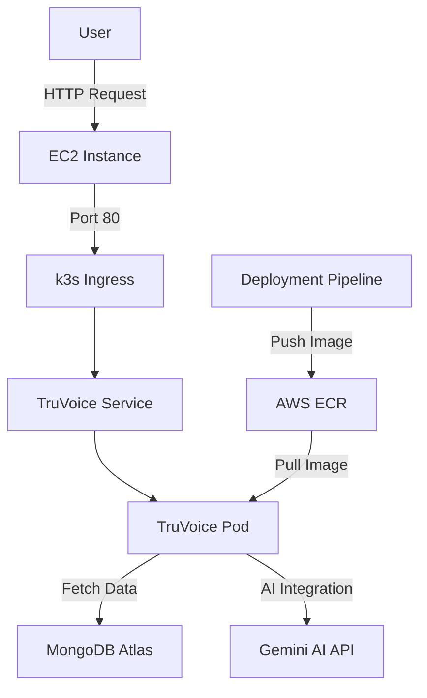

# TruVoice Kubernetes Deployment Report

## 📋 Project Overview

**TruVoice** is an anonymous feedback platform with AI integration that has been deployed using AWS ECR and Kubernetes (k3s) on AWS Free Tier resources.

- **Project Name**: TruVoice
- **Deployment Type**: Kubernetes (k3s) on AWS EC2
- **Cost Model**: AWS Free Tier
- **Live Demo**: [http://44.192.70.116/](http://44.192.70.116/)
- **GitHub Repository**: [https://github.com/Kirtan134/TruVoice/tree/deployment](https://github.com/Kirtan134/TruVoice/tree/deployment)

## 🏗️ Architecture

### Core Components



### Detailed Architecture

| Component | Description | Technology |
| --- | --- | --- |
| **Infrastructure** | Cloud hosting environment | AWS EC2 t2.micro instance (Free Tier) |
| **Container Orchestration** | Lightweight Kubernetes distribution | k3s |
| **Container Registry** | Docker image storage | AWS ECR |
| **Application Server** | Web application framework | Next.js |
| **Database** | NoSQL document database | MongoDB Atlas (external) |
| **Authentication** | User authentication system | NextAuth.js with JWT tokens |
| **AI Integration** | Natural language processing | Gemini AI API |

### Deployment Files

- **Application**
  - `Dockerfile` - Multi-stage build for the Next.js application
  
- **Kubernetes Resources**
  - `k8s/deployment.yaml` - Application deployment configuration
  - `k8s/service.yaml` - Service configuration for external access
  - `k8s/ingress.yaml` - Ingress configuration
  - `k8s/secrets.yaml` - Template for application secrets
  - `k8s/ecr-secret-template.txt` - Reference for creating ECR auth secret

## 🔧 Deployment Process

### Prerequisites

The following prerequisites are required before deployment:

- [x] AWS Account with ECR repository
- [x] Docker installed on local development machine
- [x] kubectl configured to connect to the Kubernetes cluster
- [x] Kubernetes Cluster (k3s) running on an EC2 instance
- [x] MongoDB Atlas account with a database setup
- [x] Gemini AI API key for AI integration

### Step 1: AWS ECR Configuration

```bash
# Create ECR repository
aws ecr create-repository --repository-name truvoice
```

### Step 2: Docker Image Build and Push

```bash
# Build and tag the image
docker build -t truvoice:latest .
docker tag truvoice:latest YOUR_AWS_ACCOUNT_ID.dkr.ecr.YOUR_REGION.amazonaws.com/truvoice:latest

# Login to ECR
aws ecr get-login-password --region YOUR_REGION | docker login --username AWS --password-stdin YOUR_AWS_ACCOUNT_ID.dkr.ecr.YOUR_REGION.amazonaws.com

# Push the image
docker push YOUR_AWS_ACCOUNT_ID.dkr.ecr.YOUR_REGION.amazonaws.com/truvoice:latest
```

### Step 3: Kubernetes Secret Configuration

#### ECR Authentication Secret

```bash
# Create secret for ECR authentication
kubectl create secret docker-registry ecr-secret \
  --docker-server=YOUR_AWS_ACCOUNT_ID.dkr.ecr.YOUR_REGION.amazonaws.com \
  --docker-username=AWS \
  --docker-password=$(aws ecr get-login-password --region YOUR_REGION)
```

#### Application Secrets

```yaml
# k8s/secrets.yaml
apiVersion: v1
kind: Secret
metadata:
  name: truvoice-secrets
type: Opaque
stringData:
  mongodb-uri: "your-mongodb-uri"
  nextauth-secret: "your-nextauth-secret"
  gemini-api-key: "your-gemini-api-key"
  client-id: "your-client-id"
  client-secret: "your-client-secret"
  redirect-uri: "your-redirect-uri"
  refresh-token: "your-refresh-token"
  email: "your-email"
```

```bash
# Apply the secrets
kubectl apply -f k8s/secrets.yaml
```

> [!WARNING]
> Never commit the actual secrets.yaml file to Git. Create it directly on your cluster or use a secure secrets management solution.

### Step 4: Kubernetes Resource Deployment

```bash
# Apply deployment, service, and ingress
kubectl apply -f k8s/deployment.yaml
kubectl apply -f k8s/service.yaml
kubectl apply -f k8s/ingress.yaml
```

### Step 5: Port Forwarding Configuration

```bash
# Get the NodePort assigned to your service
NODE_PORT=$(kubectl get svc truvoice-service -o jsonpath='{.spec.ports[0].nodePort}')

# Set up port forwarding from port 80 to NodePort
sudo iptables -t nat -A PREROUTING -p tcp --dport 80 -j REDIRECT --to-port $NODE_PORT

# Make the port forwarding persistent (survives reboots)
sudo apt-get install iptables-persistent -y
sudo netfilter-persistent save
```

## 🔄 Operational Management

### Updating the Application

```bash
# Build and push new image
docker build -t YOUR_AWS_ACCOUNT_ID.dkr.ecr.YOUR_REGION.amazonaws.com/truvoice:latest .
docker push YOUR_AWS_ACCOUNT_ID.dkr.ecr.YOUR_REGION.amazonaws.com/truvoice:latest

# Restart the deployment to pick up the new image
kubectl rollout restart deployment/truvoice-app

# Monitor the rollout
kubectl rollout status deployment/truvoice-app
```

### Scaling the Application

```bash
# Scale to more replicas (if needed)
kubectl scale deployment/truvoice-app --replicas=2

# Note: For free tier, keep this at 1 to stay within resource limits
```

### Resource Monitoring

```bash
# List all resources
kubectl get all

# Check pods status
kubectl get pods

# Check deployment details
kubectl describe deployment truvoice-app
```

### Logs and Debugging

```bash
# View logs for a pod
kubectl logs -f $(kubectl get pods -l app=truvoice -o jsonpath='{.items[0].metadata.name}')

# Get details of a pod
kubectl describe pod $(kubectl get pods -l app=truvoice -o jsonpath='{.items[0].metadata.name}')

# Check service configuration
kubectl get svc truvoice-service -o yaml
```

## 🔍 Troubleshooting Guide

### Common Issues and Solutions

> [!TIP] 
> This section documents common issues you might encounter during deployment and their solutions.

#### 1. Image Pull Error

**Symptom**: Pods show `ImagePullBackOff` status

**Solution**:
```bash
# Check if ECR secret is correct
kubectl get secret ecr-secret -o yaml

# Re-create ECR secret if needed
kubectl delete secret ecr-secret
kubectl create secret docker-registry ecr-secret \
  --docker-server=YOUR_AWS_ACCOUNT_ID.dkr.ecr.YOUR_REGION.amazonaws.com \
  --docker-username=AWS \
  --docker-password=$(aws ecr get-login-password --region YOUR_REGION)
```

#### 2. Application Not Starting

**Symptom**: Pods are running but the application isn't accessible

**Solution**:
```bash
# Check pod logs
kubectl logs -f $(kubectl get pods -l app=truvoice -o jsonpath='{.items[0].metadata.name}')

# Check if NodePort is configured correctly
kubectl get svc truvoice-service

# Verify port forwarding
sudo iptables -t nat -L PREROUTING
```

#### 3. Environment Variables Missing

**Symptom**: Application can't connect to external services

**Solution**:
```bash
# Check if secrets are mounted correctly
kubectl describe pod $(kubectl get pods -l app=truvoice -o jsonpath='{.items[0].metadata.name}')

# Verify the environment variables in the container
kubectl exec -it $(kubectl get pods -l app=truvoice -o jsonpath='{.items[0].metadata.name}') -- env
```

## 🔒 Security Considerations

### Security Best Practices

1. **Secret Management**
   - Never commit secrets to Git
   - Use `.gitignore` to exclude sensitive files
   - Create secrets directly on your cluster

2. **Container Image Security**
   - Regularly scan Docker images for vulnerabilities
   - Use minimal base images
   - Don't run containers as root

3. **AWS Security**
   - Secure ECR Access with IAM roles using least privilege
   - Enable VPC security groups for EC2 instances
   - Regularly rotate credentials

4. **Application Security**
   - Keep dependencies updated
   - Implement proper authentication and authorization
   - Apply security headers

## 💰 Cost Management

### AWS Free Tier Utilization

| Service | Free Tier Limit | Current Usage | Notes |
| --- | --- | --- | --- |
| **EC2 Instance** | 750 hours/month | 24/7 usage (1 instance) | t2.micro sufficient for low traffic |
| **ECR Storage** | 500MB | Varies | Each image ~200-300MB |
| **Data Transfer** | 100GB/month | Varies | Monitor during high traffic |

> [!NOTE]
> Regular monitoring of the AWS Billing Dashboard is recommended to avoid unexpected charges.

### Cost Optimization Strategies

1. **EC2 Optimization**
   - Use t2.micro instance type (Free Tier eligible)
   - Implement proper auto-scaling for cost effectiveness beyond free tier

2. **Container Optimization**
   - Use multi-stage builds to reduce image size
   - Implement proper tagging strategy to limit number of images

3. **Storage and Traffic**
   - Monitor and clean up unused images
   - Implement caching strategies to reduce database calls

## 📊 Performance Monitoring

### Key Metrics to Monitor

- **Node Resource Usage**: CPU, Memory, Disk
- **Pod Resource Usage**: CPU, Memory
- **Application Performance**: Response time, Error rate
- **Network**: Bandwidth usage, Latency

### Monitoring Tools

- kubectl commands for basic monitoring
- AWS CloudWatch for EC2 monitoring
- Consider lightweight solutions like:
  - Prometheus + Grafana (for more advanced monitoring)
  - k9s (for real-time cluster management)

## 🔄 Backup and Disaster Recovery

### Backup Strategy

1. **Database Backup**
   - MongoDB Atlas provides automated backups
   - Schedule regular backups for critical data

2. **Configuration Backup**
   - Store Kubernetes manifests in version control
   - Document all custom configurations

### Disaster Recovery Plan

1. **Recovery Process**
   - Document step-by-step recovery procedure
   - Test recovery process periodically

2. **High Availability Considerations**
   - For production, consider multi-node deployment
   - Implement proper health checks and readiness probes

## 📚 Additional Resources

- [Kubernetes Documentation](https://kubernetes.io/docs/home/)
- [k3s Documentation](https://docs.k3s.io/)
- [AWS ECR Documentation](https://docs.aws.amazon.com/ecr/)
- [Next.js Deployment Documentation](https://nextjs.org/docs/deployment)
- [MongoDB Atlas Documentation](https://docs.atlas.mongodb.com/)
